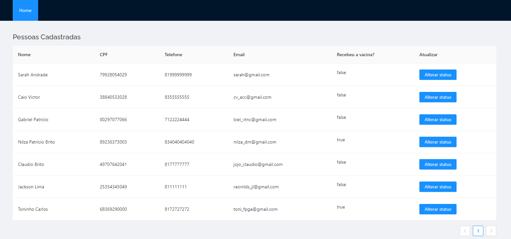

## :bulb: eVaccine - website

The "eVacinne" is a registration website where people can register to receive the vaccine according to their priority conditions.

## 🎨 Layout 

<p align="center">
    <br/>
</p>

<br>

## 🚀 Technologies

In this project were used these technologies:

<code></code>
<code></code> 
<code></code> 

<br/> 


## :information_source: How To run?

To clone and run this application, you'll need [Git](https://git-scm.com), Node.js and Jdk 11 installed on your computer.


### Install API 

```bash
# Clone this repository
$ git clone https://github.com/SarahToscano/evaccine

# Go into the repository
$ cd evaccine/server2

# Install dependencies
$ yarn install

# Run Migrates
$ yarn typeorm migration:run

# Start server
$ yarn start

# running on port 3333
```

### Install Front-end

```bash
# Clone this repository
$ git clone https://github.com/SarahToscano/evaccine

# Go into the repository
$ cd evaccine/web

# Install dependencies
$ npm install

# Run
$ npm start

# running on port 3000
```

